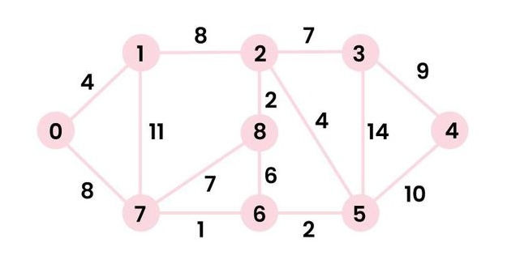

# Kitchen_Sink

A C & Xojo library with various functions that could come in handy. Comes with C test code, and a Xojo test application.

### C API

```c
void hexDump(unsigned char *buf, long len);
```
Self-explanatory

```c
unsigned long djb2(unsigned char *str, int len);
```
djb2 hash.

```c
unsigned long sdbm(unsigned char *str, int len);
```
sdbm hash.

```c
unsigned long loselose(unsigned char *str, int len);
```
lose lose hash.

```c
void fillRandom(unsigned char *buffer, unsigned int len);
```
Fills a buffer with random numbers from `/dev/random`.

```c
void SieveOfEratosthenes(long n);
```
Sieve of Eratosthenes.

```c
unsigned char isPrime(long n);
```
Uses a sieve of Eratosthenes to determine whether a number is a prime.

```c
int basicGCD(int a, int b) {
```
Calculates GCD of two integers.

```c
int iterativeBinarySearch(int arr[], int low, int high, int x);
```
Iterative Binary Search.

```c
int recursiveBinarySearch(int arr[], int low, int high, int x);
```
Recursive Binary Search.

```c
void bubbleSortInt(int array[], int size);
```
BubbleSort for integers.

```c
void bubbleSortDouble(double array[], int size);
```
BubbleSort for doubles.

```c
void insertionSortInt(int array[], int size);
```
InsertionSort for integers.

```c
void insertionSortDouble(double array[], int size);
```
InsertionSort for doubles.

```c
void mergeSortInt(int arr[], int l, int r);
```
MergeSort for integers.

```c
void mergeSortDouble(double arr[], int l, int r);
```
MergeSort for doubles.

```c
void quickSortInt(int array[], int low, int high);
```
QuickSort for integers.

```c
void quickSortDouble(double array[], int low, int high);
```
QuickSort for doubles.

### Python

The library can be used with ctypes, as shown by `test_sink.py`.

## DEMO

```
Last login: Tue Dec 31 09:13:23 on ttys002
dda@Didiers-MacBook-Pro Kitchen_Sink % make clean
rm *.o *.dylib test_sink
rm: *.o: No such file or directory
make: *** [clean] Error 1
dda@Didiers-MacBook-Pro Kitchen_Sink % make
gcc -Wall -O3 -g -c *.c
gcc *.o -o test_sink
gcc -dynamic *.o -o kitchen_sink.dylib
dda@Didiers-MacBook-Pro Kitchen_Sink % make test
gcc -dynamic *.o -o kitchen_sink.dylib
./test_sink
   +------------------------------------------------+ +----------------+
   |.0 .1 .2 .3 .4 .5 .6 .7 .8 .9 .a .b .c .d .e .f | |      ASCII     |
   +------------------------------------------------+ +----------------+
00.|6f b9 8d ea e9 54 23 44 52 00 91 50 74 f2 f4 52 | |o....T#DR..Pt..R|
01.|8e dd 7b 5e 76 0a 00 00 00 00 00 00 00 00 00 00 | |..{^v...........|
02.|00 00 00 00 00 00 00 00 00 00 00 00 00 00 00 00 | |................|
03.|00 00 00 00 00 00 00 00 00 00 00 00 00 00 00 00 | |................|
04.|00 00 00 00 00 00 00 00 00 00 00 00 00 00 00 00 | |................|
05.|00 00 00 00 00 00 00 00 00 00 00 00 00 00 00 00 | |................|
06.|00 00 00 00 00 00 00 00 00 00 00 00 00 00 00 00 | |................|
07.|00 00 00 00 00 00 00 00 00 00 00 00 00 00 00 00 | |................|
   +------------------------------------------------+ +----------------+
djb2: 0xAA3621E4174F1A2B
sdbm: 0xC110E6C744E439C2
lose lose: 0x00000AE6

764587 is prime

iterativeBinarySearch
 • Element 10 is present at index 3
 • Element 41 is not present in array!

recursiveBinarySearch
 • Element 90 is not present in array!
 • Element 40 is present at index 7

Before Bubble sorting arr1:
 • 89, 12, 33, 23, 127, 24, 10, 40
After:
 • 10, 12, 23, 24, 33, 40, 89, 127

Before Insertion sorting arr11:
 • 89, 12, 33, 23, 127, 24, 10, 40
After:
 • 10, 12, 23, 24, 33, 40, 89, 127

Before Merge sorting arr12:
 • 89, 12, 33, 23, 127, 24, 10, 40
After:
 • 10, 12, 23, 24, 33, 40, 89, 127

Before Bubble sorting arr2:
 • 2.100, 3.600, 1.400, 40.653, 40.642
After:
 • 1.400, 2.100, 3.600, 40.642, 40.653

Before Insertion sorting arr22:
 • 40.653, 2.100, 3.600, 1.400, 40.642
After:
 • 1.400, 2.100, 3.600, 40.642, 40.653

Before Quick sorting arr23:
 • 40.567, 2.120, 3.230, 1.340, 40.456
After:
 • 1.340, 2.120, 3.230, 40.456, 40.567
GCD(10, 15) = 5
GCD(35, 10) = 5
GCD(31, 2) = 1
GCD(99, 12) = 3


Graph:
        0    1    2    3    4    5    7    8    9
====================================================
 0 |    0    4    0    0    0    0    0    8    0 |
 1 |    4    0    8    0    0    0    0   11    0 |
 2 |    0    8    0    7    0    4    0    0    2 |
 3 |    0    0    7    0    9   14    0    0    0 |
 4 |    0    0    0    9    0   10    0    0    0 |
 5 |    0    0    4   14   10    0    2    0    0 |
 6 |    0    0    0    0    0    2    0    1    6 |
 7 |    8   11    0    0    0    0    1    0    7 |
 8 |    0    0    2    0    0    0    6    7    0 |
====================================================


Vertex 		Distance from source = 0
   0 			0
   1 			4
   2 			12
   3 			19
   4 			21
   5 			11
   6 			9
   7 			8
   8 			14

Vertex 		Distance from source = 3
   0 			19
   1 			15
   2 			7
   3 			0
   4 			9
   5 			11
   6 			13
   7 			14
   8 			9

python3 ./test_sink.py
bubbleSortInt
[89, 12, 33, 23, 127, 24, 10, 40]
[10, 12, 23, 24, 33, 40, 89, 127]
insertionSortInt
[89, 12, 33, 23, 127, 24, 10, 40]
[10, 12, 23, 24, 33, 40, 89, 127]
mergeSortInt
[89, 12, 33, 23, 127, 24, 10, 40]
[10, 12, 23, 24, 33, 40, 89, 127]
quickSortInt
[89, 12, 33, 23, 127, 24, 10, 40]
[10, 12, 23, 24, 33, 40, 89, 127]

iterativeBinarySearch
 • Element 40 is present at index 5
 • Element 41 is not present in array!

recursiveBinarySearch
 • Element 40 is present at index 5
 • Element 41 is not present in array!

GCD(10, 15) = 5
GCD(35, 10) = 5
GCD(31, 2) = 1
GCD(99, 12) = 3


Graph:
        0    1    2    3    4    5    7    8    9
====================================================

 0 |    0    4    0    0    0    0    0    8    0 |
 1 |    4    0    8    0    0    0    0   11    0 |
 2 |    0    8    0    7    0    4    0    0    2 |
 3 |    0    0    7    0    9   14    0    0    0 |
 4 |    0    0    0    9    0   10    0    0    0 |
 5 |    0    0    4   14   10    0    2    0    0 |
 6 |    0    0    0    0    0    2    0    1    6 |
 7 |    8   11    0    0    0    0    1    0    7 |
 8 |    0    0    2    0    0    0    6    7    0 |
====================================================


Vertex 		Distance from source = {source}

   0 			0
   1 			4
   2 			12
   3 			19
   4 			21
   5 			11
   6 			9
   7 			8
   8 			14
% 
```



### Xojo API

```
Sub HexDump(mb As MemoryBlock)
```
Self-explanatory
```
Function djb2_hash(mb As MemoryBlock) As UInt32
```
djb2 hash, from the library.
```
Function djb2_native(mb As MemoryBlock) As UInt32
```
djb2 hash, in Xojo.
```
Function sdbm_hash(mb As MemoryBlock) As UInt32
```
sdbm hash, from the library.
```
Function sdbm_native(mb As MemoryBlock) As UInt32
```
sdbm hash, in Xojo.
```
Function loselose_hash(mb As MemoryBlock) As UInt32
```
lose lose hash, from the library.
```
Function loselose_native(mb As MemoryBlock) As UInt32
```
lose lose hash, in Xojo.
```
Sub FillRandomBuffer(buffer As MemoryBlock, len As Integer)
```
Fills a buffer with random numbers from `/dev/random`.
```
Function IsPrime(n As UInt64) As Boolean
```
Uses a sieve of Eratosthenes to determine whether a number is a prime.
```
Function iterBinSearch(arr() As Integer, x As Integer) As Integer
```
Iterative Binary Search.
```
Function recursiveBinSearch(arr() As Integer, x As Integer) As Integer
```
Recursive Binary Search.

```
Function BubbleSort(arr() As Integer / Double) As Integer() / Double()
```
BubbleSort
```
Function InsertionSort(arr() As Integer / Double) As Integer() / Double()
```
Insertion Sort
```
Function MergeSort(arr() As Integer / Double) As Integer() / Double()
```
MergeSort
```
Function QuickSort(arr() As Integer / Double) As Integer() / Double()
```
QuickSort

### DEMO

```
% ./Kitchen_Sink_test
Installing Lib
Building Buffer
Displaying Buffer
   +------------------------------------------------+ +----------------+
   |.0 .1 .2 .3 .4 .5 .6 .7 .8 .9 .a .b .c .d .e .f | |      ASCII     |
   +------------------------------------------------+ +----------------+
00.|02 e9 59 3d 1f a3 63 dd 79 16 22 9a b4 ab 68 db | |..Y=..c.y."...h.|
01.|e0 d9 95 e8 1c e4 7c 94 6f bd 90 53 a5 6a 82 f5 | |......|.o..S.j..|
02.|87 85 49 dc da 3c 1c 33 07 ad 40 07 a2 d0 f2 7d | |..I..<.3..@....}|
03.|82 1b e2 d3 65 13 a8 9b 03 c0 7f fc 48 5a db 00 | |....e......HZ..|
   +------------------------------------------------+ +----------------+

 • djb2 hash
djb2: 0x1BC2400A
 • djb2 native hash
djb2: 0x1BC2400A
 • Match!

 • sdbm hash
sdbm: 0x21806989
 • sdbm native hash
sdbm: 0x21806989
 • Match!

 • loselose hash
loselose: 0x2085
 • loselose native hash
loselose: 0x2085
 • Match!

97 is prime!
98 is not prime!

ITERATIVE BINARY SEARCH:
Looking for 10:
 • 1075 µs
 • 10 found at position 2 [10]
Looking for 41:
 • 23 µs
 • 41: not found!

RECURSIVE BINARY SEARCH:
Looking for 40:
 • 17 microseconds
 • 40 found at position 3 [40]
Looking for 41:
 • 24 microseconds
 • 41: not found!

BubbleSort:
 Before:
 • -1174
 • 22406
 • 12172
 • 4101
 • -925
 • 573
 • 3969
 • 17914
 • 26638
 • 19808
 • 30500
 • 805
 • 31285
 • 29268
 • 7157
 • 5356
 • 15 microseconds
 After:
 • -1174
 • -925
 • 573
 • 805
 • 3969
 • 4101
 • 5356
 • 7157
 • 12172
 • 17914
 • 19808
 • 22406
 • 26638
 • 29268
 • 30500
 • 31285

InsertionSort:
 Before:
 • 3969
 • 805
 • 17914
 • 5356
 • 12172
 • 4101
 • 19808
 • 30500
 • 22406
 • -1174
 • 26638
 • 7157
 • -925
 • 573
 • 29268
 • 31285
 • 14 microseconds
 After:
 • -1174
 • -925
 • 573
 • 805
 • 3969
 • 4101
 • 5356
 • 7157
 • 12172
 • 17914
 • 19808
 • 22406
 • 26638
 • 29268
 • 30500
 • 31285

MergeSort:
 Before:
 • 26638
 • 31285
 • 12172
 • 5356
 • 7157
 • -1174
 • 4101
 • 29268
 • -925
 • 30500
 • 17914
 • 805
 • 3969
 • 19808
 • 22406
 • 573
 • 15 microseconds
 After:
 • -1174
 • -925
 • 573
 • 805
 • 3969
 • 4101
 • 5356
 • 7157
 • 12172
 • 17914
 • 19808
 • 22406
 • 26638
 • 29268
 • 30500
 • 31285

QuickSort:
 Before:
 • -925
 • 26638
 • 5356
 • 3969
 • 31285
 • 7157
 • 22406
 • 573
 • 805
 • 29268
 • 19808
 • 30500
 • -1174
 • 4101
 • 12172
 • 17914
 • 13 microseconds
 After:
 • -1174
 • -925
 • 573
 • 805
 • 3969
 • 4101
 • 5356
 • 7157
 • 12172
 • 17914
 • 19808
 • 22406
 • 26638
 • 29268
 • 30500
 • 31285

BubbleSort:
 Before:
 • -1382.329
 • -376.8072
 • -30.72289
 • 425.3012
 • 373.5944
 • 3121.185
 • 2588.052
 • -2095.382
 • -2824.498
 • -3064.659
 • 409.9398
 • 2414.257
 • 1896.988
 • -1875.1
 • -2173.594
 • -106.4257
 • 17 microseconds
 After:
 • -3064.659
 • -2824.498
 • -2173.594
 • -2095.382
 • -1875.1
 • -1382.329
 • -376.8072
 • -106.4257
 • -30.72289
 • 373.5944
 • 409.9398
 • 425.3012
 • 1896.988
 • 2414.257
 • 2588.052
 • 3121.185

GCD:
 • GCD(10, 15) = 5
 • GCD(35, 10) = 5
 • GCD(31, 2) = 1
 • GCD(99, 12) = 3
```
