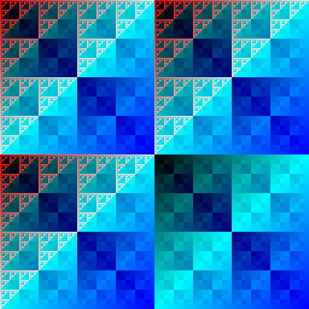
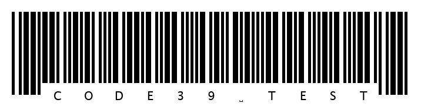
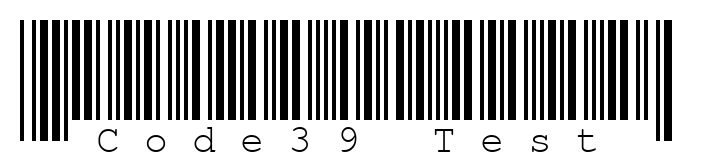

# Kitchen_Sink

A C & Xojo library with various functions that could come in handy. Comes with C test code, and a Xojo test application.

## C API

### Binary Search

```c
void quickSortInt(int array[], int low, int high);
int iterativeBinarySearch(int arr[], int low, int high, int x);
int recursiveBinarySearch(int arr[], int low, int high, int x);
int minDistance(int dist[], bool sptSet[], int V);
void Dijkstra(int V, int graph[V][V], int src, int* dist);
```

### Compression

```c
void printArray(int arr[], int n);
void swapMinHNode(struct MinHNode **a, struct MinHNode **b);
void minHeapify(struct MinHeap *minHeap, int idx);
int checkSizeOne(struct MinHeap *minHeap);
struct MinHNode *extractMin(struct MinHeap *minHeap);
void insertMinHeap(struct MinHeap *minHeap, struct MinHNode *minHeapNode);
void buildMinHeap(struct MinHeap *minHeap);
int isLeaf(struct MinHNode *root);
struct MinHeap *createAndBuildMinHeap(char item[], int freq[], int size);
struct MinHNode *buildHuffmanTree(char item[], int freq[], int size);
void printHCodes(struct MinHNode *root, char arr[], int top);
```

### Dict

```c
Dictionary *create_dict(void);
int add_item_label(Dictionary *, char label[], void *);
int add_item_index(Dictionary *, int index, void *);
void *get_element_label(Dictionary *, char[]);
void *get_element_index(Dictionary *, int);
void destroy(Dictionary *);
```

### Hashes

```c
void fillRandom(unsigned char *buffer, unsigned int len);
void hexDump(unsigned char *buf, long len);
unsigned long djb2(unsigned char *str, int len);
unsigned long sdbm(unsigned char *str, int len);
unsigned long loselose(unsigned char *str, int len);
void MD5Init(MD5_CTX *);
void MD5Update(MD5_CTX *, unsigned char *, unsigned int);
void MD5Final(unsigned char *, MD5_CTX *);
static void MD5Transform(UINT4[4], unsigned char[64]);
static void Encode(unsigned char *, UINT4 *, unsigned int);
static void Decode(UINT4 *, unsigned char *, unsigned int);
```

### Maths

```c
void SieveOfEratosthenes(long n);
unsigned char isPrime(long n);
int basicGCD(int a, int b);
int basicLCM(int a, int b);
bool isLeapYear(int year);
double factorial(int n);
float haversine(float lat1, float lon1, float lat2, float lon2, bool metric);
float toRad(float x);
```

### Sort

```c
void bubbleSortInt(int array[], int size);
void bubbleSortDouble(double array[], int size);
void insertionSortInt(int array[], int size);
void insertionSortDouble(double array[], int size);
void mergeInt(int arr[], int p, int q, int r);
void mergeSortInt(int arr[], int l, int r);
void mergeDouble(double arr[], int p, int q, int r);
void mergeSortDouble(double arr[], int l, int r);
int qsPartitionInt(int array[], int low, int high);
void quickSortInt(int array[], int low, int high);
int qsPartitionDouble(double array[], int low, int high);
void quickSortDouble(double array[], int low, int high);
int getMaxInt(int array[], int n);
```

### Barcodes
```
* int c39GetSize(int ln);
* int createCode39(char *myText, int ln, char *buffer);
* bool qrcodegen_Text_Easy(char *myText, uint8_t qrcode[]);
* int qrcodegen_getSize(const uint8_t qrcode[]);
* bool qrcodegen_getModule(const uint8_t qrcode[], int x, int y);
```

## C Demo

```
./test_sink 
   +------------------------------------------------+ +----------------+
   |.0 .1 .2 .3 .4 .5 .6 .7 .8 .9 .a .b .c .d .e .f | |      ASCII     |
   +------------------------------------------------+ +----------------+
00.|63 ac 9d a5 fa e2 29 67 37 33 42 c6 6f 65 35 10 | |c.....)g73B.oe5.|
01.|b4 9c e1 fd 5f 2e ab f5 87 6f 56 10 9d 32 ae 28 | |...._....oV..2.(|
02.|f2 48 39 0c 82 f8 3c 54 e1 fa 43 1e be 91 0e 0f | |.H9...<T..C.....|
03.|65 20 26 8f b0 11 92 c6 2b af d6 c4 5b e2 bb 88 | |e &.....+...[...|
04.|70 60 dd 1f 3c a5 e9 3a b2 e9 bb 16 30 e3 58 bb | |p`..<..:....0.X.|
05.|f1 f4 3b 2e 4e 6c 8f 13 70 8a 51 22 6f 94 d5 fe | |..;.Nl..p.Q"o...|
06.|18 4c b1 85 af c4 4a 9b 3e f6 c5 9f a1 25 57 15 | |.L....J.>....%W.|
07.|42 57 dd 96 f8 7e 34 66 18 04 e4 44 12 78 30 00 | |BW...~4f...D.x0.|
   +------------------------------------------------+ +----------------+
djb2: 0xF84B6294983F9366
sdbm: 0x775E41F027ECC183
lose lose: 0x00003D41

764587 is prime
65536 is not prime

iterativeBinarySearch
 • Element 10 is present at index 3
 • Element 41 is not present in array!

recursiveBinarySearch
 • Element 90 is not present in array!
 • Element 40 is present at index 7

Before Bubble sorting arr1:
 • 89, 12, 33, 23, 127, 24, 10, 40
After:
 • 10, 12, 23, 24, 33, 40, 89, 127

Before Insertion sorting arr11:
 • 89, 12, 33, 23, 127, 24, 10, 40
After:
 • 10, 12, 23, 24, 33, 40, 89, 127

Before Merge sorting arr12:
 • 89, 12, 33, 23, 127, 24, 10, 40
After:
 • 10, 12, 23, 24, 33, 40, 89, 127

Before Bubble sorting arr2:
 • 40.653, 2.100, 3.600, 1.400, 40.642
After:
 • 1.400, 2.100, 3.600, 40.642, 40.653

Before Insertion sorting arr22:
 • 40.653, 2.100, 3.600, 1.400, 40.642
After:
 • 1.400, 2.100, 3.600, 40.642, 40.653

Before Quick sorting arr23:
 • 40.653, 2.100, 3.600, 1.400, 40.642
After:
 • 1.400, 2.100, 3.600, 40.642, 40.653

GCD(10, 15) = 5
LCM(10, 15) = 30
GCD(35, 10) = 5
LCM(35, 10) = 70
GCD(31, 2) = 1
LCM(31, 2) = 62
GCD(99, 12) = 3
LCM(99, 12) = 396


Graph:
        0    1    2    3    4    5    7    8    9
====================================================
 0 |    0    4    0    0    0    0    0    8    0 |
 1 |    4    0    8    0    0    0    0   11    0 |
 2 |    0    8    0    7    0    4    0    0    2 |
 3 |    0    0    7    0    9   14    0    0    0 |
 4 |    0    0    0    9    0   10    0    0    0 |
 5 |    0    0    4   14   10    0    2    0    0 |
 6 |    0    0    0    0    0    2    0    1    6 |
 7 |    8   11    0    0    0    0    1    0    7 |
 8 |    0    0    2    0    0    0    6    7    0 |
====================================================


Vertex 		Distance from source = 0
   0 			0
   1 			4
   2 			12
   3 			19
   4 			21
   5 			11
   6 			9
   7 			8
   8 			14

Vertex 		Distance from source = 3
   0 			19
   1 			15
   2 			7
   3 			0
   4 			9
   5 			11
   6 			13
   7 			14
   8 			9


 Char | Huffman code
------|-------------
  n   | 0000
  d   | 00010000
  g   | 000100010
  o   | 000100011
  o   | 0001001
  n   | 000101
  K   | 00011
  n   | 001
  i   | 01
  u   | 1
------|-------------

Compressing kitchen_sink.dylib

Decompressing kitchen_sink.flz

 Dictionaries
==============
My age is 28, and my name is Christian.
My age is 56, and my name is Bobby.
Christian's age at index 0 is 28
Bobby's age at index 0 is 56
No entry for label `salary`
Yeah, yeah, yeah, I know... Dictionaries exist in Xojo and Python...

Leap Years:
==============
Is 1900 a leap year: no
Is 1967 a leap year: no
Is 1954 a leap year: no
Is 1988 a leap year: yes
Is 2000 a leap year: yes
Is 2024 a leap year: yes

Leap Years:
==============
Fact(-1): error!
Fact(2): 2.000000
Fact(5): 120.000000
Fact(8): 40320.000000
Fact(11): 39916800.000000
Fact(14): 87178291200.000000
Fact(17): 355687428096000.000000
Fact(20): 2432902008176640000.000000
Fact(23): 25852016738884978212864.000000
Fact(26): 403291461126605650322784256.000000
Fact(29): 8841761993739700772720181510144.000000
Fact(32): 263130836933693517766352317727113216.000000
Fact(35): 10333147966386144222209170348167175077888.000000
Fact(38): 523022617466601037913697377988137380787257344.000000
Fact(41): 33452526613163802763987613764361857922667238129664.000000
Fact(44): 2658271574788448529134213028096241889243150262529425408.000000

HAVERSINE:
=============
distance between 22.400000, 113.900002 and 22.400000, 114.000000:
 • 10.28 km for normal people,
 • or for Muricans, 163.72 Boeing 787-9 airplanes (6.39 mi)

MD5 TEST:
Source:
		 This is a short 32-char message
MD5 Hash:
   +------------------------------------------------+ +----------------+
   |.0 .1 .2 .3 .4 .5 .6 .7 .8 .9 .a .b .c .d .e .f | |      ASCII     |
   +------------------------------------------------+ +----------------+
00.|4e fc 57 d3 68 b5 59 e9 d2 9a 4a 92 f7 79 04 1a | |N.W.h.Y...J..y..|
   +------------------------------------------------+ +----------------+

Source:
   +------------------------------------------------+ +----------------+
   |.0 .1 .2 .3 .4 .5 .6 .7 .8 .9 .a .b .c .d .e .f | |      ASCII     |
   +------------------------------------------------+ +----------------+
00.|63 ac 9d a5 fa e2 29 67 37 33 42 c6 6f 65 35 10 | |c.....)g73B.oe5.|
01.|b4 9c e1 fd 5f 2e ab f5 87 6f 56 10 9d 32 ae 28 | |...._....oV..2.(|
02.|f2 48 39 0c 82 f8 3c 54 e1 fa 43 1e be 91 0e 0f | |.H9...<T..C.....|
03.|65 20 26 8f b0 11 92 c6 2b af d6 c4 5b e2 bb 88 | |e &.....+...[...|
04.|70 60 dd 1f 3c a5 e9 3a b2 e9 bb 16 30 e3 58 bb | |p`..<..:....0.X.|
05.|f1 f4 3b 2e 4e 6c 8f 13 70 8a 51 22 6f 94 d5 fe | |..;.Nl..p.Q"o...|
06.|18 4c b1 85 af c4 4a 9b 3e f6 c5 9f a1 25 57 15 | |.L....J.>....%W.|
07.|42 57 dd 96 f8 7e 34 66 18 04 e4 44 12 78 30 00 | |BW...~4f...D.x0.|
   +------------------------------------------------+ +----------------+
MD5 Hash:
   +------------------------------------------------+ +----------------+
   |.0 .1 .2 .3 .4 .5 .6 .7 .8 .9 .a .b .c .d .e .f | |      ASCII     |
   +------------------------------------------------+ +----------------+
00.|b5 e1 f1 f9 0d 70 21 bd 41 1e e6 ba 4f 78 04 cf | |.....p!.A...Ox..|
   +------------------------------------------------+ +----------------+

SHA1
• SHA1Context √ (size: 104 bytes)
• SHA1Reset √
• SHA1Input √
• SHA1Result √
	80A10644 B10E579C 6241B958 FA98F129 7C035CD8 
Should match:
	80A10644 B10E579C 6241B958 FA98F129 7C035CD8

Code39
c39GetSize(6): 118
mytext:
   +------------------------------------------------+ +----------------+
   |.0 .1 .2 .3 .4 .5 .6 .7 .8 .9 .a .b .c .d .e .f | |      ASCII     |
   +------------------------------------------------+ +----------------+
00.|54 45 52 52 41 46 4f 52 4d                      | |TERRAFORM       |
   +------------------------------------------------+ +----------------+
buffer:
   +------------------------------------------------+ +----------------+
   |.0 .1 .2 .3 .4 .5 .6 .7 .8 .9 .a .b .c .d .e .f | |      ASCII     |
   +------------------------------------------------+ +----------------+
00.|00 00 00 00 00 00 00 00                         | |........        |
   +------------------------------------------------+ +----------------+
   +------------------------------------------------+ +----------------+
   |.0 .1 .2 .3 .4 .5 .6 .7 .8 .9 .a .b .c .d .e .f | |      ASCII     |
   +------------------------------------------------+ +----------------+
00.|78 20 20 78 20 78 78 20 78 78 20 78 20 78 20 78 | |x  x xx xx x x x|
01.|20 78 78 20 78 78 20 20 78 20 78 78 20 78 20 78 | | xx xx  x xx x x|
02.|78 20 20 78 20 78 20 78 78 20 78 20 78 20 78 78 | |x  x x xx x x xx|
03.|20 20 78 20 78 78 20 78 20 78 20 78 78 20 20 78 | |  x xx x x xx  x|
04.|20 78 78 20 78 20 78 20 20 78 20 78 78 20 78 20 | | xx x x  x xx x |
05.|78 78 20 78 78 20 20 78 20 78 20 78 78 20 78 20 | |xx xx  x x xx x |
06.|78 78 20 78 20 20 78 20 78 78 20 78 20 78 20 78 | |xx x  x xx x x x|
07.|78 20 20 78 20 78 78 20 78 78 20 78 20 78 20 20 | |x  x xx xx x x  |
   +------------------------------------------------+ +----------------+
08.|78 20 78 20 20 78 20 78 78 20 78 78 20 78       | |x x  x xx xx x  |
   +------------------------------------------------+ +----------------+
createCode39('terraform'): 142

Buffer
=============
   +------------------------------------------------+ +----------------+
   |.0 .1 .2 .3 .4 .5 .6 .7 .8 .9 .a .b .c .d .e .f | |      ASCII     |
   +------------------------------------------------+ +----------------+
00.|78 20 20 78 20 78 78 20 78 78 20 78 20 78 20 78 | |x  x xx xx x x x|
01.|20 78 78 20 78 78 20 20 78 20 78 78 20 78 20 78 | | xx xx  x xx x x|
02.|78 20 20 78 20 78 20 78 78 20 78 20 78 20 78 78 | |x  x x xx x x xx|
03.|20 20 78 20 78 78 20 78 20 78 20 78 78 20 20 78 | |  x xx x x xx  x|
04.|20 78 78 20 78 20 78 20 20 78 20 78 78 20 78 20 | | xx x x  x xx x |
05.|78 78 20 78 78 20 20 78 20 78 20 78 78 20 78 20 | |xx xx  x x xx x |
06.|78 78 20 78 20 20 78 20 78 78 20 78 20 78 20 78 | |xx x  x xx x x x|
07.|78 20 20 78 20 78 78 20 78 78 20 78 20 78 20 20 | |x  x xx xx x x  |
   +------------------------------------------------+ +----------------+
08.|78 20 78 20 20 78 20 78 78 20 78 78 20 78       | |x x  x xx xx x  |
   +------------------------------------------------+ +----------------+

BMP
```

Saves an image as `test.bmp`.



## Xojo API

```
* Public Function BubbleSort(arr() As Integer) As Integer()
* Public Function BubbleSort(arr() As Double) As Double()
* Public Function InsertionSort(arr() As Integer) As Integer()
* Public Function InsertionSort(arr() As Double) As Double()
* Public Function MergeSort(arr() As Integer) As Integer()
* Public Function MergeSort(arr() As Double) As Double()
* Public Function QuickSort(arr() As Integer) As Integer()
* Public Function QuickSort(arr() As Double) As Double()
* Public Function Code39_Native(myText As String, barWidth As Integer, barHeight As Integer) As Picture
* Public Function djb2_hash(mb As MemoryBlock) As UInt32
* Public Function djb2_native(mb As MemoryBlock) As UInt32
* Public Sub FillRandomBuffer(buffer As MemoryBlock, len As Integer)
* Public Sub flz(inFile As FolderItem, outFile As FolderItem)
* Public Function GCD(a As Integer, b As Integer) As Integer
* Public Function Haversine(lat1 As Double, long1 As Double, lat2 As Double, long2 As Double) As Double
* Public Sub HexDump(mb As MemoryBlock)
* Public Sub Install_Lib()
* Public Function IsPrime(n As UInt64) As Boolean
* Public Function iterBinSearch(arr() As Integer, x As Integer) As Integer
* Public Function LeapYear(year As Integer) As Boolean
* Public Function loselose_hash(mb As MemoryBlock) As UInt32
* Public Function loselose_native(mb As MemoryBlock) As UInt32
* Public Sub MidPointCircle(x_centre As Integer, y_centre As Integer, r As Integer, p As Picture, clr As Color)
* Public Function mkPassword(Length As Integer) As String
* Public Function recursiveBinSearch(arr() As Integer, x As Integer) As Integer
* Public Function sdbm_hash(mb As MemoryBlock) As UInt32
* Public Function sdbm_native(mb As MemoryBlock) As UInt32
* Public Function sha1(mb As MemoryBlock) As MemoryBlock
* Public Sub ShuffleBuffer(mb As MemoryBlock)
* Public Function Code39_Native(myText As String, barWidth As Integer, barHeight As Integer) As Picture
* Public Function Generate_QR(txt As String, ecl As Integer, minVersion As Integer, maxVersion As Integer, mask As Integer) As Picture
```

## Xojo Demo

```
% ./test_sink
Last login: Thu Jan 30 16:07:25 on ttys001
/Users/dda/Coding/Xojo/Kitchen_Sink/Builds\ -\ Kitchen_Sink/macOS\ Universal/Kitchen_Sink_test/Kitchen_Sink_test ; exit;
dda@Didiers-MacBook-Pro ~ % /Users/dda/Coding/Xojo/Kitchen_Sink/Builds\ -\ Kitchen_Sink/macOS\ Universal/Kitchen_Sink_test/Kitchen_Sink_test ; exit;
Installing Lib
Building Buffer
Displaying Buffer
   +------------------------------------------------+ +----------------+
   |.0 .1 .2 .3 .4 .5 .6 .7 .8 .9 .a .b .c .d .e .f | |      ASCII     |
   +------------------------------------------------+ +----------------+
00.|27 59 4b 32 38 53 87 a6 3e e3 39 1e 86 d2 f5 4b | |'YK28S..>.9....K|
01.|07 e8 de 3a 8e 37 88 e7 5f 81 3d 4c 7f ad a5 db | |...:.7.._.=L...|
02.|6b 66 b0 95 90 4d 4d 91 24 e8 f0 62 01 81 7e f0 | |kf...MM.$..b..~.|
03.|07 7f 08 56 80 63 7d 81 28 6a 3b 97 0f a7 22 00 | |..V.c}.(j;...".|
   +------------------------------------------------+ +----------------+

 • djb2 hash
djb2: 0xF38F451A
 • djb2 native hash
djb2: 0xF38F451A
 • Match!

 • sdbm hash
sdbm: 0x9FE492E3
 • sdbm native hash
sdbm: 0x9FE492E3
 • Match!

 • loselose hash
loselose: 0x1C35
 • loselose native hash
loselose: 0x1C35
 • Match!

97 is prime!
98 is not prime!

ITERATIVE BINARY SEARCH:
Looking for 10:
 • 523 µs
 • 10 found at position 2 [10]
Looking for 41:
 • 17 µs
 • 41: not found!

RECURSIVE BINARY SEARCH:
Looking for 40:
 • 10 microseconds
 • 40 found at position 3 [40]
Looking for 41:
 • 15 microseconds
 • 41: not found!

BubbleSort:
 Before:
 • 32596
 • 3811
 • 22537
 • 26269
 • 670
 • -1996
 • 27591
 • 22731
 • 17910
 • 15488
 • 17398
 • 28344
 • 25907
 • 2500
 • -1840
 • 30159
 • 11 microseconds
 After:
 • -1996
 • -1840
 • 670
 • 2500
 • 3811
 • 15488
 • 17398
 • 17910
 • 22537
 • 22731
 • 25907
 • 26269
 • 27591
 • 28344
 • 30159
 • 32596

InsertionSort:
 Before:
 • -1996
 • 17910
 • -1840
 • 670
 • 32596
 • 3811
 • 30159
 • 26269
 • 25907
 • 2500
 • 15488
 • 22731
 • 28344
 • 22537
 • 27591
 • 17398
 • 14 microseconds
 After:
 • -1996
 • -1840
 • 670
 • 2500
 • 3811
 • 15488
 • 17398
 • 17910
 • 22537
 • 22731
 • 25907
 • 26269
 • 27591
 • 28344
 • 30159
 • 32596

MergeSort:
 Before:
 • 28344
 • 25907
 • 670
 • 3811
 • -1996
 • 30159
 • 27591
 • -1840
 • 22537
 • 17398
 • 17910
 • 2500
 • 15488
 • 26269
 • 22731
 • 32596
 • 11 microseconds
 After:
 • -1996
 • -1840
 • 670
 • 2500
 • 3811
 • 15488
 • 17398
 • 17910
 • 22537
 • 22731
 • 25907
 • 26269
 • 27591
 • 28344
 • 30159
 • 32596

QuickSort:
 Before:
 • 26269
 • 30159
 • 22731
 • 27591
 • 17910
 • 28344
 • 22537
 • 17398
 • 25907
 • -1840
 • 3811
 • 15488
 • -1996
 • 2500
 • 670
 • 32596
 • 10 microseconds
 After:
 • -1996
 • -1840
 • 670
 • 2500
 • 3811
 • 15488
 • 17398
 • 17910
 • 22537
 • 22731
 • 25907
 • 26269
 • 27591
 • 28344
 • 30159
 • 32596

BubbleSort:
 Before:
 • 1237.651
 • 853.7149
 • 1427.309
 • 2549.9
 • -2839.759
 • 2764.759
 • 550.502
 • 1579.217
 • -2392.47
 • -860.1406
 • -2255.12
 • 497.5904
 • 1739.157
 • -251.7068
 • -947.6908
 • -2995.783
 • 11 microseconds
 After:
 • -2995.783
 • -2839.759
 • -2392.47
 • -2255.12
 • -947.6908
 • -860.1406
 • -251.7068
 • 497.5904
 • 550.502
 • 853.7149
 • 1237.651
 • 1427.309
 • 1579.217
 • 1739.157
 • 2549.9
 • 2764.759

GCD:
 • GCD(10, 15) = 5
 • GCD(35, 10) = 5
 • GCD(31, 2) = 1
 • GCD(99, 12) = 3

Leap Years:
1900 is not a leap year.
1954 is not a leap year.
1967 is not a leap year.
1988 is a leap year.
2000 is a leap year.
2024 is a leap year.


Haversine:
Distance between 22.4, 113.9 and 22.4, 114 = 10.28 km, 6.387696 mi.

Shuffle:
==========
Before:
   +------------------------------------------------+ +----------------+
   |.0 .1 .2 .3 .4 .5 .6 .7 .8 .9 .a .b .c .d .e .f | |      ASCII     |
   +------------------------------------------------+ +----------------+
00.|30 31 32 33 34 35 36 37 38 39 61 62 63 64 65 66 | |0123456789abcdef|
   +------------------------------------------------+ +----------------+

After:
   +------------------------------------------------+ +----------------+
   |.0 .1 .2 .3 .4 .5 .6 .7 .8 .9 .a .b .c .d .e .f | |      ASCII     |
   +------------------------------------------------+ +----------------+
00.|61 32 38 62 30 37 63 66 64 35 34 36 31 65 39 33 | |a28b07cfd5461e93|
   +------------------------------------------------+ +----------------+
```

And pops open a Code39 image:



```
QR Code:
 • QRsize: 21
##############  ####        ##############
##          ##  ######  ##  ##          ##
##  ######  ##  ##  ####    ##  ######  ##
##  ######  ##    ####      ##  ######  ##
##  ######  ##  ##  ##  ##  ##  ######  ##
##          ##        ####  ##          ##
##############  ##  ##  ##  ##############
                    ######                
##    ##############    ####    ##  ######
              ########  ####      ####    
##############  ##        ##        ######
##    ######          ##  ##  ##    ##    
        ##  ####  ##            ####  ##  
                ##      ########  ##  ####
##############  ######  ######  ##  ##    
##          ##  ##    ########  ######  ##
##  ######  ##  ####  ####    ##  ##  ##  
##  ######  ##  ##    ##  ####            
##  ######  ##    ########################
##          ##          ##  ##############
##############  ####  ########            
```

And pops open a QR Code image:


## Python Demo

```
% python3 test_sink.py
bubbleSortInt
[89, 12, 33, 23, 127, 24, 10, 40]
[10, 12, 23, 24, 33, 40, 89, 127]
insertionSortInt
[89, 12, 33, 23, 127, 24, 10, 40]
[10, 12, 23, 24, 33, 40, 89, 127]
mergeSortInt
[89, 12, 33, 23, 127, 24, 10, 40]
[10, 12, 23, 24, 33, 40, 89, 127]
quickSortInt
[89, 12, 33, 23, 127, 24, 10, 40]
[10, 12, 23, 24, 33, 40, 89, 127]

iterativeBinarySearch
 • Element 40 is present at index 5
 • Element 41 is not present in array!

recursiveBinarySearch
 • Element 40 is present at index 5
 • Element 41 is not present in array!

GCD(10, 15) = 5
LCM(10, 15) = 30
GCD(35, 10) = 5
LCM(35, 10) = 70
GCD(31, 2) = 1
LCM(31, 2) = 62
GCD(99, 12) = 3
LCM(99, 12) = 396

764587 is prime
65536 is not prime

Leap Years:
==============
Is 2000 a leap year: yes
Is 1954 a leap year: no
Is 1988 a leap year: yes
Is 2024 a leap year: yes
Is 1900 a leap year: no
Is 1967 a leap year: no

HAVERSINE:
=============
Distance between 22.4, 113.9 and 22.4, 114.0:
 • 0 km for normal people,
 • or for Muricans, 0.0 Grizzly bears (0.0 mi)


Graph:
        0    1    2    3    4    5    7    8    9
====================================================

 0 |    0    4    0    0    0    0    0    8    0 |
 1 |    4    0    8    0    0    0    0   11    0 |
 2 |    0    8    0    7    0    4    0    0    2 |
 3 |    0    0    7    0    9   14    0    0    0 |
 4 |    0    0    0    9    0   10    0    0    0 |
 5 |    0    0    4   14   10    0    2    0    0 |
 6 |    0    0    0    0    0    2    0    1    6 |
 7 |    8   11    0    0    0    0    1    0    7 |
 8 |    0    0    2    0    0    0    6    7    0 |
====================================================


Vertex 		Distance from source = {source}

   0 			0
   1 			4
   2 			12
   3 			19
   4 			21
   5 			11
   6 			9
   7 			8
   8 			14

SHA1:
• SHA1Context √ (size: 8 bytes)
• SHA1Reset √
• SHA1Input √
• SHA1Result √

• Hash:	80A10644 B10E579C 6241B958 FA98F129 7C035CD8
Expecting:
	80A10644 B10E579C 6241B958 FA98F129 7C035CD8
Match!


Code39:
====================
c39GetSize(tLen): 163
mytext:
   +------------------------------------------------+ +----------------+
   |.0 .1 .2 .3 .4 .5 .6 .7 .8 .9 .a .b .c .d .e .f | |      ASCII     |
   +------------------------------------------------+ +----------------+
00.|43 6f 64 65 33 39 20 54 65 73 74                | |Code39 Test     |
   +------------------------------------------------+ +----------------+
buffer:
   +------------------------------------------------+ +----------------+
   |.0 .1 .2 .3 .4 .5 .6 .7 .8 .9 .a .b .c .d .e .f | |      ASCII     |
   +------------------------------------------------+ +----------------+
00.|00 00 00 00 00 00 00 00                         | |........        |
   +------------------------------------------------+ +----------------+
   +------------------------------------------------+ +----------------+
   |.0 .1 .2 .3 .4 .5 .6 .7 .8 .9 .a .b .c .d .e .f | |      ASCII     |
   +------------------------------------------------+ +----------------+
00.|78 20 20 78 20 78 78 20 78 78 20 78 20 78 78 20 | |x  x xx xx x xx |
01.|78 78 20 78 20 20 78 20 78 20 78 78 20 78 20 78 | |xx x  x x xx x x|
02.|78 20 78 20 20 78 20 78 20 78 20 78 78 20 20 78 | |x x  x x x xx  x|
03.|20 78 78 20 78 78 20 78 20 78 78 20 20 78 20 78 | | xx xx x xx  x x|
04.|20 78 78 20 78 78 20 20 78 20 78 20 78 20 78 20 | | xx xx  x x x x |
05.|78 78 20 20 78 20 78 78 20 78 20 78 20 20 78 78 | |xx  x xx x x  xx|
06.|20 78 20 78 78 20 78 20 78 20 78 20 78 78 20 78 | | x xx x x x xx x|
07.|78 20 20 78 20 78 78 20 78 20 78 78 20 20 78 20 | |x  x xx x xx  x |
   +------------------------------------------------+ +----------------+
08.|78 20 78 20 78 78 20 78 20 78 78 20 20 78 20 78 | |x x xx x xx  x x|
09.|20 78 20 78 78 20 78 78 20 20 78 20 78 20 20 78 | | x xx xx  x x  x|
0a.|20 78 78 20 78 78 20 78                         | | xx xx x        |
   +------------------------------------------------+ +----------------+
createCode39: 168
Number of chunks per char: 12
[24, 72, 120, 168, 216, 264, 312, 360, 408, 456, 504, 552, 600, 648, 692]
Drawing C at 96
Drawing o at 144
Drawing d at 192
Drawing e at 240
Drawing 3 at 288
Drawing 9 at 336
Drawing   at 384
Drawing T at 432
Drawing e at 480
Drawing s at 528
Drawing t at 576
```

And pops open a Code39 image:



```

QR Code:
=======

  ##############  ####        ##############
  ##          ##  ######  ##  ##          ##
  ##  ######  ##  ##  ####    ##  ######  ##
  ##  ######  ##    ####      ##  ######  ##
  ##  ######  ##  ##  ##  ##  ##  ######  ##
  ##          ##        ####  ##          ##
  ##############  ##  ##  ##  ##############
                      ######                
  ##    ##############    ####    ##  ######
                ########  ####      ####    
  ##############  ##        ##        ######
  ##    ######          ##  ##  ##    ##    
          ##  ####  ##            ####  ##  
                  ##      ########  ##  ####
  ##############  ######  ######  ##  ##    
  ##          ##  ##    ########  ######  ##
  ##  ######  ##  ####  ####    ##  ##  ##  
  ##  ######  ##  ##    ##  ####            
  ##  ######  ##    ########################
  ##          ##          ##  ##############
  ##############  ####  ########            

```

And pops open a QR Code image:


